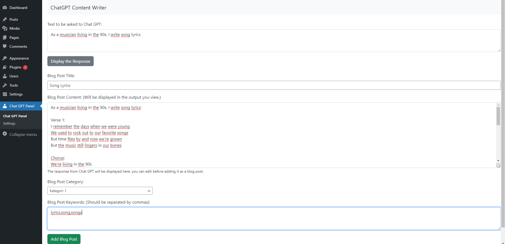

# Chat GPT Content Writer | Wordpress Plugin
افزونه تولید محتوا با هوش مصنوعی چت جی پی تی برای وردپرس

# ِFA
این افزونه وردپرس به شما این امکان را  می دهد به کمک توکن API دریافتی از وبسایت OpenAI متن های خودکار مرتبط با عناوین مختلف تولید و در وبسایت خود منتشر کنید از زمان سبقت بگیرید و با محتوای جذاب به سرعت در گوگل دیده شوید. 

<h2>مراحل نصب:</h2> 
<b>1-) </b> افزونه Chat GPT Content Writer را دانلود کنید 
<b>2-)</b>افزونه را روی وردپرس نصب کنید. 
<b>3-)</b> کلید API خود را در از سایت مربوطه دریافت کرده و در بخش تنظیمات وارد کنید  (برای ایجاد کلید
API: https://beta.openai.com/account/api-keys) 
<b>4-)</b>اکنون می توانید افزونه را از قسمت داشبرد مدیریت کنید. 

# تصاویر
 

افزونه به طور مداوم در حال توسعه است، برای ارتباط و پشتیبانی می توانید از لینک های زیر استفاده کنید.

# Rahanesh
Telegram Channel: (t.me/Rahanesh)

Buy me a coffee or LinuxVPS 🙈  
https://zarinp.al/rahanesh.ir  
https://t.me/RahaneshPaybot  

Contact:Telegram: t.me/Rahanesh  
----------------------------
بازدید پست های تلگرامی با ربات رهاسین 
https://t.me/RahaSeeBot  
ربات ویرایش نام آهنگ در تلگرام   
https://t.me/MP3ChangeNameBot  
ربات پنل شبکه های اجتماعی  
https://t.me/RahaPanelBot  

