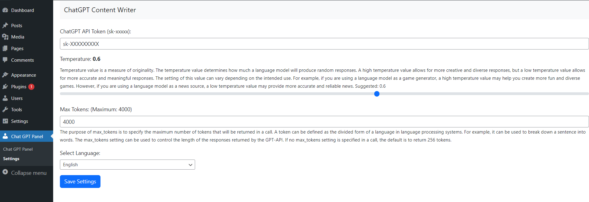

# Chat GPT Content Writer | Wordpress Plugin
افزونه تولید محتوا با هوش مصنوعی چت جی پی تی برای وردپرس

# ِFA
این افزونه وردپرس به شما این امکان را  می دهد متنی را که می نویسید به عنوان یک پست وبلاگ وردپرس با استفاده از Chat GPT API اضافه کنید.

<h2>مراحل نصب:</h2> 
<b>1-)</b> افزونه Chat GPT Content Writer را دانلود کنید. 
<b>2-)</b>افزونه را روی وردپرس نصب کنید. 
<b>3-)</b> کلید API خود را در از سایت مربوطه دریافت کرده و در بخش تنظیمات وارد کنید  (برای ایجاد کلید API: https://beta.openai.com/account/api-keys) 
<b>4-)</b>برای آماده استفاده است، اکنون می توانید افزونه را از قسمت داشبرد مدیریت کنید. 

# تصاویر
 

افزونه به طور مداوم در حال توسعه است، برای ارتباط و پشتیبانی می توانید از لینک های زیر استفاده کنید.

# Rahanesh
Telegram Channel: (t.me/Rahanesh)

Buy me a coffee or VP 🙈
https://zarinp.al/rahanesh.ir
https://t.me/RahaneshPaybot
Contact:
Telegram: t.me/Rahanesh
----------------------------
بازدید پست های تلگرامی با ربات رهاسین
https://t.me/RahaSeeBot
ربات ویرایش نام آهنگ در تلگرام 
https://t.me/MP3ChangeNameBot
ربات پنل شبکه های اجتماعی
https://t.me/RahaPanelBot

